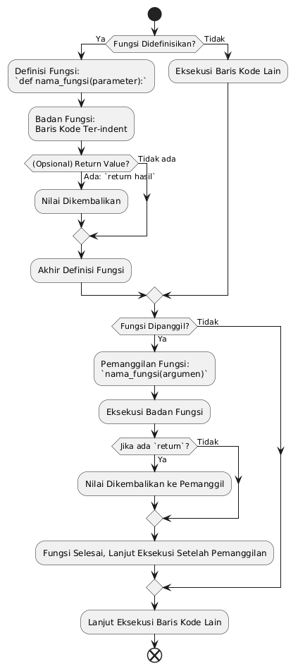

Memahami Fungsi dalam Python
Selamat datang di repositori ini! Di sini, kita akan menjelajahi konsep fungsi dalam bahasa pemrograman Python. Fungsi adalah blok kode terorganisir dan dapat digunakan kembali yang melakukan satu tindakan terkait. Fungsi membantu kita memecah program menjadi bagian-bagian yang lebih kecil dan modular, membuatnya lebih mudah dikelola, dibaca, dan di-debug.

Apa Itu Fungsi?
Dalam pemrograman, fungsi memiliki beberapa tujuan utama:

Modularitas: Memecah program besar menjadi unit-unit yang lebih kecil dan dapat diatur.
Reusabilitas Kode: Menulis kode sekali dan menggunakannya berkali-kali di berbagai bagian program atau bahkan di program lain.
Keterbacaan: Membuat kode lebih mudah dibaca dan dipahami karena setiap fungsi memiliki tujuan spesifik.
Debugging: Mempermudah pelacakan dan perbaikan kesalahan karena masalah dapat diisolasi ke fungsi tertentu.
Struktur Fungsi Python
Fungsi dalam Python didefinisikan menggunakan kata kunci def, diikuti dengan nama fungsi, tanda kurung (), dan titik dua :. Blok kode di dalam fungsi harus di-indent.

Python

def nama_fungsi(parameter1, parameter2):
    """
    Docstring: Penjelasan singkat tentang apa yang dilakukan fungsi ini.
    """
    # Kode yang akan dijalankan oleh fungsi
    hasil = parameter1 + parameter2
    return hasil # Mengembalikan nilai dari fungsi
def: Kata kunci untuk mendefinisikan fungsi.
nama_fungsi: Nama unik untuk fungsi Anda. Pilihlah nama yang deskriptif.
parameter1, parameter2: (Opsional) Variabel yang menerima nilai input saat fungsi dipanggil.
:: Menandai awal blok kode fungsi.
Docstring ("""..."""): String dokumentasi opsional yang menjelaskan fungsi. Sangat disarankan untuk praktik terbaik.
Blok Kode: Baris-baris kode yang di-indent di bawah def.
return: (Opsional) Digunakan untuk mengembalikan nilai dari fungsi. Jika tidak ada return, fungsi akan mengembalikan None secara implisit.

Flowchart
